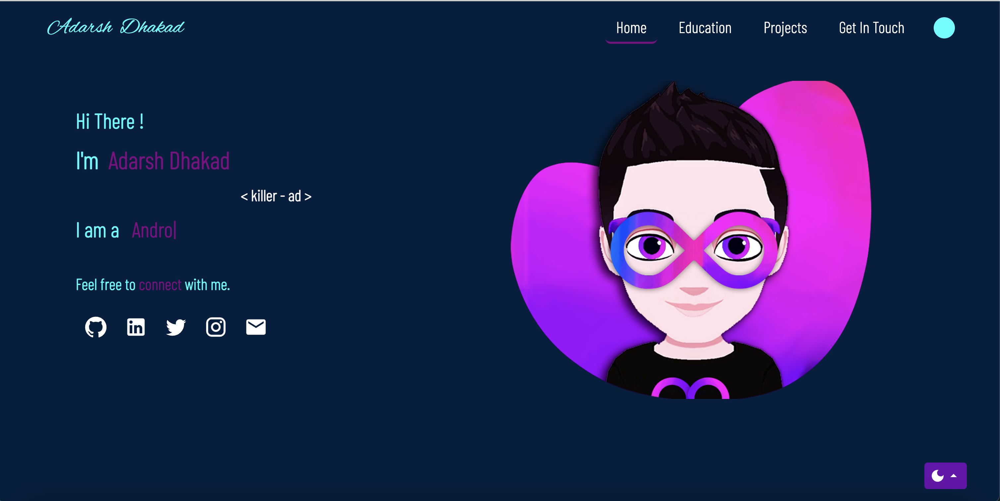
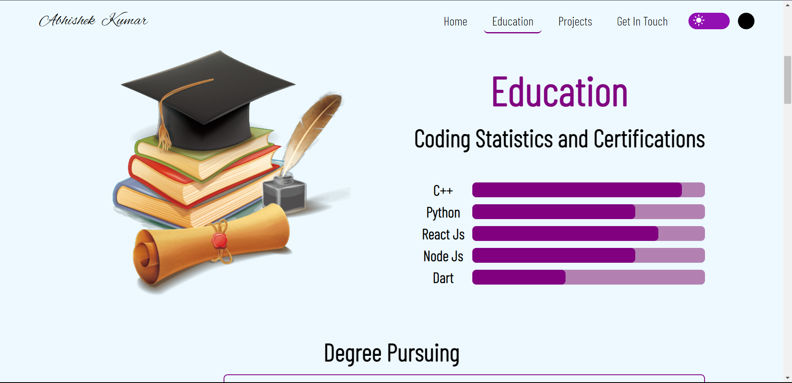
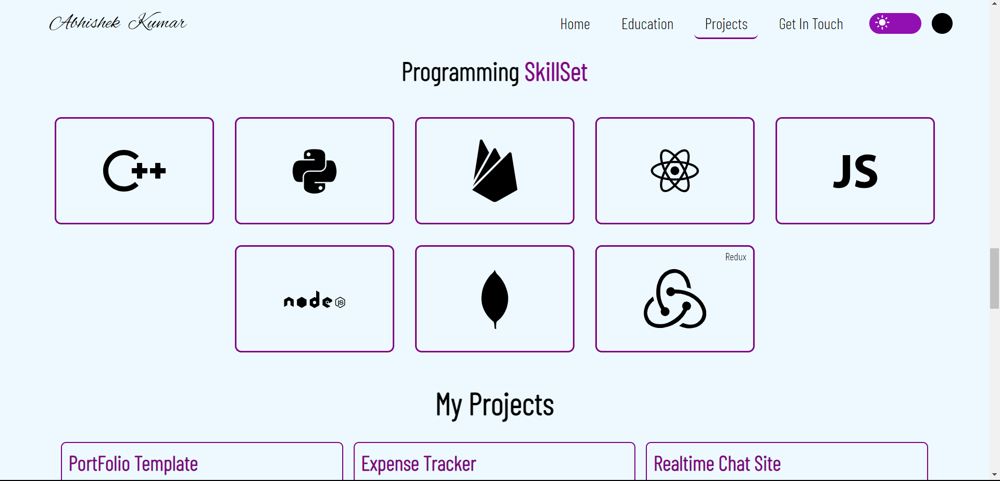
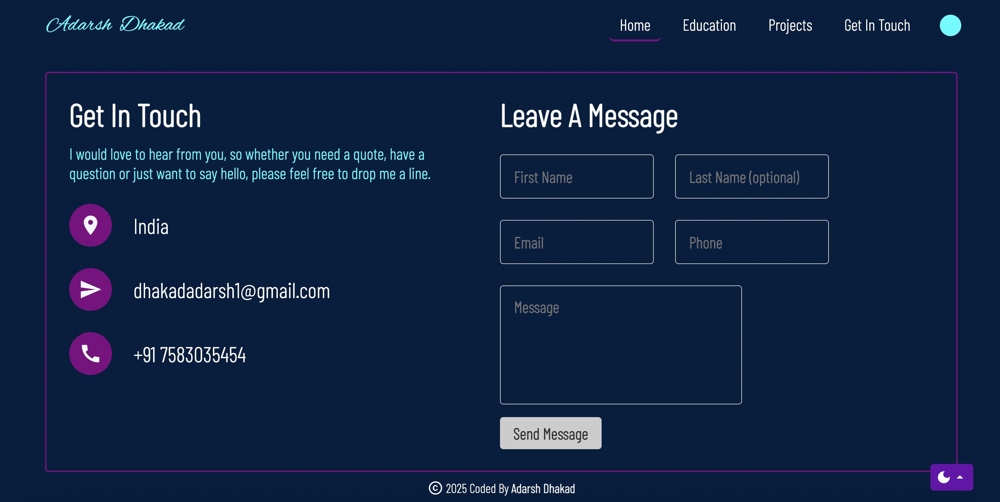

# Nidhi Rahangdale's Portfolio

Welcome to my professional portfolio! This repository showcases my skills, projects, and achievements. Feel free to explore the code and projects listed here.

## Screenshots
  
  
  
  
## Table of Contents

- [Home](#home)
- [Education](#education)
- [Professional Skills](#skills)
- [Get In Touch](#getInTouch)
- [License](#license)

## Contact

Connect with me! Feel free to reach out for collaboration, job opportunities, or just to say hello.

- **Email:** rahangdalenidhio8@gmail.com
- **LinkedIn:** [https://www.linkedin.com/in/nrrn/](linkedin-link)
- **Portfolio:** [https://nidhi-rahangdale.github.io/Portfolio/](your-portfolio-link)

## License

This project is licensed under the MIT License - see the [LICENSE](LICENSE) file for details.

---

Thank you for visiting my portfolio! If you find it interesting, don't forget to ⭐️ the repository.
